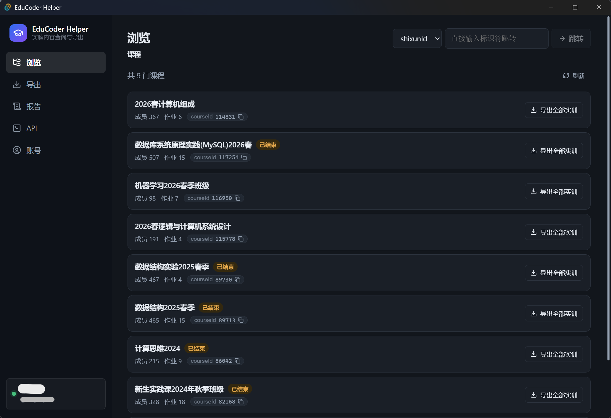

<div align="center">


<h1>EduCoder Helper</h1>

**把头歌上的实训，一键搬回你自己的电脑。**

课程 → 作业 → 关卡，任务描述和你写过的代码，整整齐齐导出成本地文件夹。

<p>


</p>

### [⬇️ 下载最新版本](../../releases/latest)

下载 → 双击 → 登录 → 开始导出。

</div>

---

## ✨ 它能帮你做什么

### 📦 一键导出，三种粒度

| 想导出的东西 | 你得到的 |
| --- | --- |
| **单个关卡** | 一个文件夹：`README.md`（任务描述）+ 该关所有可编辑文件 |
| **整个实训** | 每一关一个子目录，按顺序排好，全实训一次搞定 |
| **整门课程** | 课程下所有实训作业，一次性全量备份 |

### 🖼️ 任务描述里的图片不再裂图

平台的任务描述用的是站内相对路径（`/api/attachments/…`），存到本地直接打开必然是一排裂图。
导出时可以选择怎么处理：

| 选项 | 效果 | 适合 |
| --- | --- | --- |
| **改写链接**（默认） | 换成 educoder.net 完整链接 | 文件小，联网就能看 |
| **保存图片** | 下载到每关的 `images/` 并改为相对路径 | 真·离线备份 |
| **保持原样** | 不动任务描述 | 只想要原始文本 |


### 🤖 一键起草实验报告

勾选整门课程里要写进报告的关卡（按实训分组，支持全选 / 部分选），粘贴任务书、实验要求和学院给的
报告模板，交给 AI 按模板的章节结构逐节起草：

| 你给的 | 它产出的 |
| --- | --- |
| 勾选的关卡 | `报告.md`：课程任务概述 → 任务实施过程与分析（每实训一节、每关一小节）→ 课程总结 → 附录 |
| 任务书 / 实验要求 / 报告模板 | 按模板确定章节结构与详略；简单代码直贴、复杂代码讲思路 |
| 你的 API Key | 每关的题目与代码另存到 `素材/`，可直接作为作业要求的"源码目录"打包 |

需要截图和运行结果的地方会留下 🖼️ / 📋 占位符提示你补充，AI 不会编造运行结果。

**三种后端任选：**

| 后端 | 要什么 | 适合 |
| --- | --- | --- |
| **API（OpenAI 兼容）** | 你自己的 API Key | 最通用；DeepSeek、通义、Kimi、智谱、硅基流动、OpenAI… 内置预设 |
| **Claude Code（本地）** | 本机装好并登录过 `claude` | 不用 API Key，走你已有的订阅 |
| **Codex（本地）** | 本机装好并登录过 `codex` | 同上 |

本地后端会自动探测可执行文件位置，找不到可手填路径；生成期间工具已被禁用，它不会去读写你的文件。
注意每次调用会带上该 CLI 自身的系统提示与工具定义（实测约 15k~33k token 的固定开销）——订阅制
用户只是消耗额度，按 token 计费的用户走直连 API 更划算。

> ⚠️ 生成的是**初稿**。请逐节核对代码与描述是否与你实际提交的一致，补齐占位符后再提交。

### 🔐 登录只要点一下

内置登录窗口直接打开 educoder.net 官方登录页——账号密码、验证码、第三方登录都行。
登录成功后应用自己把凭证收好、窗口自己关掉。

> 不用装浏览器扩展，不用按 F12 翻 Cookie，不用复制粘贴一长串字符。全程不碰你的密码。

### 🖥️ 五个页面，覆盖全部功能



| | 页面 | 你能干什么 |
| --- | --- | --- |
| 👤 | **账号** | 一键登录、查看当前用户、凭证导入 / 导出 / 清除 |
| 🧭 | **浏览** | 课程 → 作业 → 关卡层层点进去，直接看任务描述和仓库里的代码 |
| 📤 | **导出** | 关卡 / 实训 / 课程三级导出，带进度日志和取消按钮 |
| 📊 | **分数** | 作业报告：每一关的分数、改动了哪些文件 |
| ✨ | **实验报告** | 勾选关卡 → AI 按模板起草整门课程的实践报告，并导出题目与代码素材 |
| 🛠️ | **API** | 内置调试台，直接发 `GET` / `POST` / 任意请求 |

## ⬇️ 下载

前往 **[Releases](../../releases/latest)** 选择对应文件：

| 系统 | 文件 |
| --- | --- |
| Windows (Intel/AMD) | `educoder-helper-x86_64.exe` |
| Windows (ARM64) | `educoder-helper-aarch64.exe` |
| macOS (Intel + Apple Silicon) | `educoder-helper-universal` |
| Linux (x64) | `educoder-helper-x86_64-linux` |

- **Windows**：双击即用，只需系统自带的 WebView2 运行时（Win 10/11 默认已有）。
- **macOS**：下载后需 `chmod +x educoder-helper-universal`；首次打开若提示「无法验证开发者」，
  在「系统设置 → 隐私与安全性」里点「仍要打开」，或执行
  `xattr -dr com.apple.quarantine educoder-helper-universal`。
- **Linux**：需要系统已安装 `webkit2gtk-4.1`（Ubuntu：`sudo apt install libwebkit2gtk-4.1-0`），
  下载后 `chmod +x` 即可运行。

## 🚀 三步上手

1. **下载**上面对应你系统的文件，双击打开。
2. 进入「账号」页，点 **「打开登录窗口」**，在弹出的 educoder.net 页面正常登录。
   登录成功后窗口会自动关闭，凭证被保存到应用配置目录，**下次启动自动载入**。
3. 进入「导出」页，填入关卡 / 实训 / 课程的 ID（可以先在「浏览」页点着找），点导出。

> Session 凭证会定期过期。如果请求开始报登录失效，回「账号」页重新登录一次就好。

---

<details>
<summary>

## 🧰 两种形态

</summary>

| | 说明 | 运行要求 |
| --- | --- | --- |
| **桌面 GUI** | 基于 [Tauri](https://tauri.app) 的图形界面，见 [`gui/`](gui/) | 单个可执行文件，无需安装 Node |
| **命令行 / 库** | `edu` 命令与 `EduClient` 类 | Node ≥ 18，无第三方依赖 |

两者功能覆盖一致。GUI 的后端是 Node 核心逻辑（签名、Cookie、客户端、导出器）的 Rust 移植，
详见 [`gui/README.md`](gui/README.md)。GUI 的五个页面与 CLI 命令一一对应：

| 页面 | 对应命令 |
| --- | --- |
| 账号 | 浏览器登录、`me`、凭证的导入 / 导出 / 清除 |
| 浏览 | `courses` → `homeworks` → `challenges` → `task` / `code`，以及 `enter` |
| 导出 | `export challenge` / `export shixun` / `export course`，带实时日志与取消 |
| 报告 | `report` |
| API | `get` / `post` / `raw` |

</details>

<details>
<summary>

## 🔑 登录凭证

</summary>

两种用法都用你浏览器里的 `educoder.net` 登录凭证访问接口，不涉及密码。

**GUI**：在「账号」页点「打开登录窗口」，在弹出的 educoder.net 页面里正常登录
（账号密码、验证码、第三方登录都可以）。登录成功后应用会自动读取该窗口的 Cookie 并关闭它，
无需安装扩展或复制粘贴。凭证会以 `cookies.txt` 格式写入应用配置目录，下次启动自动载入。

**CLI / 库**：需要一份 Netscape 格式的 `cookies.txt`。可以直接复用 GUI 写出的那一份
（把 `$EDUCODER_COOKIES` 指向它，或在 GUI 里「另存为 cookies.txt」），
也可以用浏览器扩展
[Get cookies.txt LOCALLY](https://chromewebstore.google.com/detail/get-cookiestxt-locally/cclelndahbckbenkjhflpdbgdldlbecc)
自行导出。查找优先级：

1. `--cookies <file>`（CLI）/ `new EduClient({ cookiesPath })`（库）
2. `$EDUCODER_COOKIES` 环境变量
3. 项目根目录下的 `./cookies.txt`

Session Cookie 会定期过期，若请求返回登录重定向或 401，GUI 里重新登录一次、CLI 重新导出即可。

</details>

<details>
<summary>

## ⌨️ 命令行用法

</summary>

```bash
# 基本查询
node bin/edu.js me                              # 查看当前登录用户
node bin/edu.js courses                         # 我的课程列表
node bin/edu.js homeworks <courseId>            # 实训作业列表（type 4）
node bin/edu.js homeworks <courseId> 1          # 图文作业列表（type 1）
node bin/edu.js challenges <shixunId>           # 某实训的关卡列表（已有实例时附带各关 gameId）
node bin/edu.js task <gameId> [--desc]          # 关卡详情；--desc 只输出任务描述 Markdown
node bin/edu.js code <gameId> <path>            # 读取仓库文件当前内容
node bin/edu.js report <reportId>               # 作业报告（每关分数/改动文件）
node bin/edu.js enter <shixunId>                # 进入实训，返回第一关 gameId

# 导出（存储代码和任务描述至本地）
node bin/edu.js export challenge <gameId> [dir]      # 导出单个挑战：README.md + 可编辑文件
node bin/edu.js export shixun <myshixunId> [dir]     # 导出整个实训（每个挑战一个子目录）
node bin/edu.js export course <courseId> [dir]       # 导出课程所有实训作业
                                                     # [dir] 默认为导出对象的名称

# 原始请求
node bin/edu.js get /api/users/get_user_info.json
node bin/edu.js post /api/some/endpoint body.json
node bin/edu.js raw PUT /api/some/endpoint body.json
echo '{"k":1}' | node bin/edu.js post /api/some/endpoint   # 从 stdin 读取请求体
```

选项：`--cookies <file>`、`--pretty`（默认，输出精炼的中文摘要）、`--raw`（输出完整 JSON；对 `get`/`post`/`raw` 则为原样响应体，不解析 JSON）。

`--images <mode>` 控制任务描述里 `/api/attachments/…` 图片的处理方式，三级导出通用：

| mode | 行为 |
| --- | --- |
| `link`（默认） | 改写为 `https://www.educoder.net/api/attachments/…` 绝对链接 |
| `download` | 下载到该关的 `images/` 子目录，引用改为相对路径 |
| `keep` | 保持原样（本地打开看不到图） |

这些附件无需登录即可访问，所以两种修复方式都成立；`download` 会为每张图多发一次请求。

通过 `npm link` 安装为全局 `edu` 命令后，可省略 `node bin/edu.js`。注意：

- `npm link` 是符号链接，**移动或删除本仓库目录后命令会失效**。
- 卸载：`npm unlink -g educoder-helper`。
- 若提示找不到 `edu`，请确认 npm 全局 bin 目录（`npm prefix -g`）已加入 PATH。

</details>

<details>
<summary>

## 📚 库用法

</summary>

```js
import { EduClient } from './edu/index.js';

const edu = new EduClient();                 // 或传入 { cookiesPath, host }

// 用户 & 课程
await edu.getUserInfo();
await edu.getCourses();                      // 默认取当前登录用户
await edu.getHomeworks(113636);              // type 默认为 4（实训作业）

// 实训 & 关卡
await edu.getChallenges('gu8nbv56');         // 实训的关卡列表（shixun identifier）
await edu.getMyChallenges('26svp3tnax');     // 我的关卡实例列表（myshixun identifier）
await edu.getTask('sfpqjg3biyn6');          // 单关详情，task_pass 为任务描述 Markdown
await edu.getFileContent('sfpqjg3biyn6', 'src/shell1.sh'); // 仓库文件内容（已 Base64 解码）
await edu.getWorkReport(296406531);          // 作业报告（stage_list）
await edu.enterShixun('gu8nbv56');          // 进入实训 → { game_identifier }

// 导出
import { exportChallenge, exportShixun, exportCourse } from './edu/index.js';
await exportChallenge(edu, gameId);   // 单关，dir 默认为 challenge.subject
await exportShixun(edu, myshixunId);  // 整个实训，dir 默认为 shixun.name
await exportCourse(edu, courseId);    // 整个课程的所有实训作业，dir 默认为 course.name

// 图片处理：'link'（默认）/ 'download' / 'keep'
await exportChallenge(edu, gameId, dir, log, { images: 'download' });
await exportShixun(edu, myshixunId, dir, log, { images: 'download' });
await exportCourse(edu, courseId, dir, { images: 'download' });

// 直接访问任意 API
await edu.get('/api/courses/113636/homework_commons.json?type=4');
await edu.post('/api/.../endpoint', { field: 'value' });
const { status, body } = await edu.request('GET', '/api/...', { raw: true });
```

`get/post/put/delete` 在非 2xx 响应时抛出异常，异常对象携带 `err.status` 和 `err.data`。
传入 `{ raw: true }` 可获得 `{ status, redirected, url, body }` 原始结果，不抛出异常。

</details>

<details>
<summary>

## 🏗️ 从源码构建 GUI

</summary>

```bash
cd gui
npm install
npm start          # 开发模式（tauri dev）
npm run bundle     # 打包（tauri build）
```

打包产物有两个，都在 `gui/src-tauri/target/release/` 下：

| 产物 | 路径 | 说明 |
| --- | --- | --- |
| **单文件 exe** | `educoder-helper-gui.exe` | 约 8 MB，双击即用，可直接拷走 |
| 安装程序 | `bundle/nsis/EduCoder Helper_1.0.0_<arch>-setup.exe` | 写开始菜单快捷方式、支持卸载 |

单文件 exe 不含任何外部依赖，只要求系统有 WebView2 运行时（Windows 10/11 默认自带）。
打包出的架构跟随构建机；要给别的架构出包，先 `rustup target add <target>`，
再 `npm run bundle -- --target <target>`（如 `x86_64-pc-windows-msvc`）。

开发/打包需要 [Rust 工具链](https://rustup.rs)；最终用户只需要打包产物，不需要 Rust 或 Node。
推送 `v*` tag 会触发 [GitHub Actions](.github/workflows/build.yml) 自动构建四个平台的产物
并上传到草稿 Release。

</details>

<details>
<summary>

## 🗂️ 目录结构

</summary>

```
educoder-helper/
  bin/edu.js        CLI 入口
  src/client.js     EduClient（认证、签名、便捷方法）
  src/sign.js       签名算法及 ak/sk 常量
  src/cookies.js    cookies.txt 加载与路径解析
  src/exporter.js   导出实训代码与任务描述、任务描述里的图片改写/下载
  src/pretty.js     CLI 默认输出的中文摘要格式化
  index.js          库导出

  gui/              Tauri 桌面应用
    src/            React + TypeScript 前端
    src-tauri/src/  Rust 后端（上述 src/*.js 的移植）
```

</details>

<details>
<summary>

## ⚠️ 免责声明

</summary>

本项目仅供学习与研究使用，用于个人备份自己账号下的数据，请遵守 `educoder.net` 的服务条款及相关法律法规。

- 使用本工具产生的一切后果由使用者自行承担，作者不承担任何责任。
- 请勿用于未经授权的访问、批量抓取、绕过平台限制或任何侵犯他人权益的用途。
- Cookie 即你的登录凭证，请妥善保管 `cookies.txt`，切勿泄露或提交到版本库。
- 本项目与 EduCoder 官方无任何关联。

</details>
